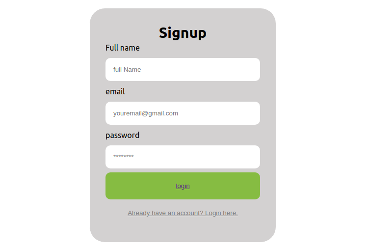

# Vegmart

## Developer - Tania Osano

## Project Description

Vegmart is an organic grocery application providing consumers with fresh natural certified farm products which will help them to take care of their nutrition. The application makes it easier for consumers to get access to the best organic goods as well as save on time.

## Website Screenshot

### Signup Page

#

### Login Page

## Working status

Still in progress

## SetUp

To access this project on your local files, clone it using the following steps

* Open the Terminal
* Clone the repository: git@github.com/helgaosano/online-vegmart.git
* Change Directory: cd online-vegmart
* Installation: npm install 
* Start server: npm start

## Technologies

